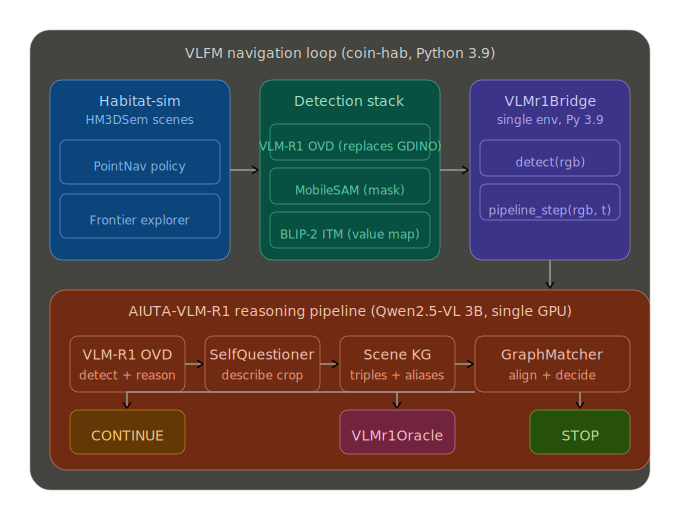

<h1 align="center">
    AIUTA-VLM-R1: Efficient Instance Navigation with<br/>Knowledge Graphs and a Single 3B VLM
</h1>

<p align="center">
    <b>AI Project — MVA + ENSTA Paris, 2025–2026</b>
</p>

<p align="center">


</p>

---

## Overview

We replace the multi-model stack of [AIUTA](https://intelligolabs.github.io/CoIN/) (LLaVA 7B + GPT-4o, 10–14 calls per detection) with a **single 3B VLM** ([VLM-R1](https://github.com/om-ai-lab/VLM-R1)) and a **deterministic Knowledge Graph**, reducing calls to **2–3 per detection** with **zero API cost**, while preserving the agent's ability to discriminate target instances from distractors.

The project has two phases:

1. **Phase 1 — IDKVQA Offline Evaluation**: Calibrating uncertainty-aware Yes/No/IDK visual question answering on 502 static samples. In a comparable setup (raw mode, no threshold tuning), VLM-R1 3B achieves φ₁ = 21.71 vs. AIUTA's 21.12 with LLaVA 7B — comparable reliability with a 2.3× smaller model.

2. **Phase 2 — CoIN-Bench Online Navigation**: Integrating the full reasoning pipeline into VLFM-based embodied navigation on [CoIN-Bench](https://huggingface.co/datasets/ftaioli/CoIN-Bench) (1,649 episodes across 3 splits).

---

## What This Project Changes vs. Original AIUTA

| | AIUTA Original (ICCV 2025) | AIUTA-VLM-R1 (ours) |
|---|---|---|
| **Models** | LLaVA 7B (VLM) + GPT-4o (LLM) | VLM-R1 3B (single model, all tasks) |
| **Calls per detection** | 10–14 (6–10 VLM + 4 LLM) | 2–3 |
| **API cost** | GPT-4o paid API | Zero (fully local) |
| **Description generation** | VLM call + LLM generates follow-up questions + VLM answers each | 1 description pass + regex extraction |
| **Uncertainty estimation** | Shannon entropy over Yes/No/IDK logits per attribute (3–5 VLM calls) | Canonical alias dictionaries + detection VQA cross-verification (0 calls) |
| **Alignment scoring** | LLM prompt → score 0–10 (1 LLM call) | GraphMatcher: deterministic KG comparison (0 calls) |
| **Question generation** | LLM composes natural-language question (1 LLM call) | QuestionGenerator selects most discriminative attribute + template (0 calls) |
| **Contradiction detection** | Not explicit — LLM may overlook conflicts in concatenated text | Explicit: Oracle says "no" + Detection VQA says "yes" → immediate rejection |
| **IDKVQA φ₁** | 21.12 (LLaVA 7B, Normalized Entropy, τ=0.75) | 21.71 (VLM-R1 3B, raw mode, no threshold tuning)¹ |

¹ Fair comparison uses `raw` mode (no threshold). Our `threshold` mode reaches φ₁=33.27 with τ=0.10, but this τ was optimized on the same 502-sample eval set and uses a different model, so the comparison conflates model and threshold effects.

**What is NOT changed**: VLFM navigation policy, BLIP-2 frontier scoring (value map), MobileSAM segmentation, PointNav movement. These remain from the original CoIN codebase.

<p align="center">

<br/><em>Side-by-side: AIUTA original (10–14 calls) vs AIUTA-VLM-R1 (2–3 calls)</em>
</p>

---

## Architecture

<p align="center">

<br/><em>System overview: VLFM navigation loop with AIUTA-VLM-R1 reasoning pipeline</em>
</p>

### Single Model, Multiple Roles

We use **one model** — `omlab/VLM-R1-Qwen2.5VL-3B-OVD-0321` (a Qwen2.5-VL-3B fine-tuned with GRPO for open-vocabulary detection) — loaded once via a `ModelLoader` singleton and reused for all tasks via different prompts:

| Role | Prompt type | Input image | Output |
|---|---|---|---|
| **Detector** | OVD with `<think>` | Full frame | Bboxes + reasoning |
| **SelfQuestioner** | "List 3–5 features" | Cropped detection | Comma-separated features |
| **Detection VQA** | "Is the bed green?" | Cropped detection | Yes/No/IDK |
| **Oracle** | "Is the bed green?" | Target instance image | Yes/No/IDK |

### Pipeline Flow (per detection)

```
Observation (512×512 RGB)
  │
  ├─ [1 VLM call] VLM-R1 OVD detection
  │     └─ <think> reasoning + <answer> bboxes
  │
  ├─ Detection Filter (area < 30%, aspect < 4.0, min 1600px)
  │
  ├─ Crop extraction from observation
  │
  ├─ [0 calls] TripleExtractor: regex on <think> → KG attributes
  │
  ├─ [1 VLM call] SelfQuestioner description pass on crop
  │     └─ "white mattress, wooden frame, near nightstand"
  │
  ├─ [0 calls] Canonical alias generation
  │     └─ think_mattress=white → color=white  (COLOR_WORDS dict)
  │     └─ think_frame=wood → material=wood    (MATERIAL_WORDS dict)
  │
  ├─ [0 calls] QuestionGenerator: pick most discriminative attribute
  │     └─ KG has color=white but target has no color fact → ask about color
  │     └─ Template: "Is the bed white in color?"
  │
  ├─ [1 VLM call] Oracle answers viewing TARGET instance image
  │     └─ "yes" → KG stores target.color=white
  │
  ├─ [0 calls*] Detection VQA: same question on CROP (cross-verification)
  │     └─ "yes" → confirms, or "no" → contradiction → CONTINUE
  │
  └─ [0 calls] GraphMatcher: deterministic alignment
        └─ target={color:white} vs obj={color:white} → score=1.0 → STOP
```

*Detection VQA reuses the already-loaded model, counted as part of the same detection cycle.

<p align="center">

<br/><em>Detailed reasoning pipeline: from VLM-R1 forward pass to STOP/CONTINUE decision</em>
</p>

### Knowledge Graph Schema

```
ObjectNode
  ├── obj_id: "bed_001"
  ├── category: "bed"
  ├── bbox: [240, 317, 504, 504]
  └── attributes:
        ├── color: white (CONFIRMED, Oracle)
        ├── material: wood (MEDIUM, VLM_REASONING)
        └── near: nightstand (MEDIUM, VLM_REASONING)

TargetFacts
  ├── category: "bed"
  ├── known_attributes: {color: white}      ← Oracle confirmed
  └── negative_attributes: {color: green}   ← Oracle denied
```

The KG is **passive memory**: it stores and retrieves facts but never generates text. The `QuestionGenerator` queries the KG to decide what to ask; `GraphMatcher` queries it to compute alignment. Both are deterministic, zero-call operations.

<p align="center">

<br/><em>Yes/No parsing chain: from Oracle answer to KG target facts, with contradiction detection</em>
</p>

---

## Phase 1: IDKVQA Offline Evaluation

Evaluated on [IDKVQA](https://huggingface.co/datasets/ftaioli/IDKVQA) (502 samples, val split). Primary metric: **Effective Reliability φ₁** — penalizes confident wrong answers more than abstentions.

### Results

| Mode | VLM Calls | φ₁ (↑) | Accuracy (↑) | Overclaim (↓) | Coverage |
|------|-----------|--------|--------------|----------------|----------|
| **`raw`** | **1** | **21.71** | **53.6%** | **54.1%** | **72.1%** |
| `threshold` (τ=0.10)† | 1 | 33.27 | 48.2% | 28.1% | 55.4% |
| `kg` | 2 | 28.69 | 32.1% | 8.9% | 8.4% |
| `two_pass_kg` | 3 | 24.10 | 40.6% | 28.8% | 51.4% |
| `relaxed` | 3 | 19.12 | 51.0% | 52.7% | 71.3% |
| `entropy` | 3 | 23.90 | 48.6% | 38.4% | 62.0% |

† τ=0.10 was optimized on the same 502-sample eval set. Bold row (`raw`) is the fair comparison to AIUTA's φ₁=21.12.

**AIUTA original baseline**: φ₁ = 21.12 (LLaVA 7B, Normalized Entropy, τ=0.75)

**Key findings**:
- **Fair comparison** (`raw` mode, no threshold tuning): VLM-R1 achieves φ₁ = 21.71 vs. AIUTA's 21.12 — comparable reliability with a 2.3× smaller model (3B vs 7B) and no API cost
- **With threshold tuning** (`threshold` mode, τ=0.10): φ₁ = 33.27, but this τ was swept on the same 502-sample eval set, so the gain conflates model calibration with threshold overfitting. A proper comparison would require a held-out τ selection set or using AIUTA's τ=0.75 on VLM-R1
- **Best accuracy**: `raw` mode — 53.6% (no abstention filtering)
- **KG mode over-abstains** on single static images (91.6% IDK rate) because without navigation context, the KG has no positive evidence to confirm. This is by design — the KG's value emerges in multi-step online navigation where it accumulates facts over time
- **Entropy threshold τ=0.10** is optimal on this eval set (found via sweep over 502 samples)

### Ablation Modes Explained

| Mode | Description |
|------|-------------|
| `raw` | Direct VLM answer only (baseline) |
| `threshold` | Raw + entropy-based abstention (IDK when entropy > τ) |
| `kg` | Detection reasoning → KG → conservative fusion |
| `two_pass_kg` | KG + structured description pass (conservative) |
| `relaxed` | Same pipeline, trust VLM answer when confident |
| `entropy` | Same pipeline, trust VLM only when entropy < τ |

---

## Phase 2: CoIN-Bench Online Navigation

### Integration Architecture

Everything runs in a **single conda environment** (`coin-hab`, Python 3.9) with the AIUTA package installed via `pip install -e`:

```
┌──────────────────────────────────────────────────────────────┐
│  Single env (Python 3.9 + Habitat + AIUTA-VLM-R1)           │
│                                                              │
│  ┌──────────┐  ┌──────────┐  ┌──────────┐  ┌────────────┐  │
│  │ Habitat  │→ │  VLFM    │→ │ BLIP-2   │→ │  PointNav  │  │
│  │ Sim      │  │ Policy   │  │ ValueMap │  │  Movement  │  │
│  └──────────┘  └────┬─────┘  └──────────┘  └────────────┘  │
│                     │                                        │
│              ┌──────┴──────┐                                 │
│              │ VLMr1Bridge │ ← thin interface                │
│              └──────┬──────┘                                 │
│                     │                                        │
│  ┌──────────────────┴──────────────────────────────────┐    │
│  │  AIUTA-VLM-R1 (pip install -e aiuta_vlmr1_project)  │    │
│  │  ┌──────────┐ ┌──────────────┐ ┌────────────────┐  │    │
│  │  │ VLM-R1   │ │SelfQuestioner│ │ KG + Matcher   │  │    │
│  │  │ Detector │ │+ TripleExtr. │ │ + QuestionGen  │  │    │
│  │  └──────────┘ └──────────────┘ └────────────────┘  │    │
│  │  ┌──────────┐                                       │    │
│  │  │VLMr1     │ ← answers questions using target      │    │
│  │  │Oracle    │   instance image (simulated user)     │    │
│  │  └──────────┘                                       │    │
│  └─────────────────────────────────────────────────────┘    │
└──────────────────────────────────────────────────────────────┘
```

### Key Components

**`VLMr1Bridge`** (`CoIN-fork/aiuta_vlmr1_bridge.py`): Thin interface between VLFM's `ObjectPointCloudMap` and the AIUTA pipeline. Handles `detect()` → bboxes and `pipeline_step()` → STOP/CONTINUE/ASK signals.

**`VLMr1Oracle`** (`CoIN-fork/vlfm/oracle/vlmr1_oracle.py`): Simulated user that answers yes/no questions by viewing the high-resolution target instance image. Replaces AIUTA's GPT-4o-based Oracle.

**`AIUTAPipeline`** (`aiuta_vlmr1/pipeline/aiuta_pipeline.py`): Orchestrates detection → SelfQuestioner → KG → InteractionTrigger → Oracle → GraphMatcher per detection cycle.

### CoIN-Bench Dataset

| Split | Episodes | Avg. Distractors |
|-------|----------|------------------|
| val_seen | 831 | 4.58 |
| val_seen_synonyms | 359 | 6.01 |
| val_unseen | 459 | 5.15 |
| **Total** | **1,649** | ~5 |

AIUTA original results (Table 2 of paper):

| Split | SR ↑ | SPL ↑ | NQ ↓ |
|-------|------|-------|------|
| val_seen | 7.42 | 2.92 | 1.67 |
| val_seen_synonyms | 14.38 | 7.99 | 1.36 |
| val_unseen | 6.67 | 2.30 | 1.13 |

Our evaluation is in progress (20-episode preliminary runs completed; full 831-episode val_seen run pending).

### Bug Fixes Applied (10 iterations)

During online integration, we identified and fixed 10 issues through iterative debugging:

1. **Oversized detections** (>50% frame area) — added `_filter_detections()` with MAX_AREA=0.30, MIN_AREA=1600px, MAX_ASPECT=4.0
2. **Self-referential descriptions** ("Describe the X of the X") — strip category name from feature extraction
3. **Open questions to yes/no Oracle** — added `YESNO_TEMPLATES` dict for all attribute types
4. **Yes/no not parsed to target facts** (critical) — rewrote `_parse_yesno_question` + `update_target_facts`
5. **Attribute name mismatch** (think_* vs canonical) — added `_classify_value_as_attribute` with COLOR_WORDS/MATERIAL_WORDS/SIZE_WORDS
6. **Detection VQA storing raw "yes"/"no"** — apply `_parse_yesno` to detection VQA responses
7. **Missing canonical aliases** — added `THINK_TO_CANONICAL` mapping + value classification
8. **False STOP on negative-only evidence** — require `positive_matched > 0`, cap score at 0.5 otherwise
9. **STOP during initialize phase** — added `MIN_STEPS_FOR_PIPELINE = 12`
10. **Stale goal point cloud** — update cloud on re-detection during navigate mode

---

## Project Structure

```
projet-ia-2026/
├── README.md
├── ai_project/
│   ├── aiuta_vlmr1_project/                 # Core reasoning package
│   │   ├── aiuta_vlmr1/
│   │   │   ├── config.py                    # YAML-driven config (Strategy pattern)
│   │   │   ├── detector/
│   │   │   │   ├── vlmr1_detector.py        # VLM-R1 OVD adapter + detection filter
│   │   │   │   ├── output_parser.py         # Parse <think>/<answer> blocks + bboxes
│   │   │   │   └── prompt_templates.py      # Detection prompts
│   │   │   ├── self_questioner/
│   │   │   │   └── vlmr1_questioner.py      # Description pass + TripleExtractor + canonical aliases
│   │   │   ├── knowledge_graph/
│   │   │   │   ├── schema.py                # ObjectNode, Attribute, TargetFacts, Certainty
│   │   │   │   ├── scene_graph.py           # Per-episode KG with object dedup & merging
│   │   │   │   ├── triple_extractor.py      # Regex extraction from <think> blocks
│   │   │   │   ├── think_feature_extractor.py  # Parse description pass features
│   │   │   │   ├── graph_matcher.py         # Deterministic alignment scoring
│   │   │   │   └── question_generator.py    # Discriminative attribute selection + templates
│   │   │   ├── interaction_trigger/
│   │   │   │   └── kg_trigger.py            # KG-based ASK/STOP/CONTINUE decisions
│   │   │   ├── pipeline/
│   │   │   │   └── aiuta_pipeline.py        # Main orchestrator (detection → KG → Oracle → match)
│   │   │   ├── evaluation/
│   │   │   │   ├── idkvqa_eval.py           # IDKVQA benchmark entry point
│   │   │   │   ├── idkvqa_kg.py             # KG hybrid fusion modes
│   │   │   │   ├── idkvqa_types.py          # Metrics: φ₁, accuracy, overclaim, underclaim
│   │   │   │   ├── coin_metrics.py          # Online metrics: SR, SPL, NQ
│   │   │   │   └── coin_loader.py           # CoIN-Bench dataset loader
│   │   │   └── utils/
│   │   │       └── model_loader.py          # Singleton model cache (config-keyed)
│   │   ├── configs/
│   │   │   ├── idkvqa_eval.yaml             # Offline eval config (τ=0.09)
│   │   │   └── vlmr1_coin.yaml              # Online CoIN config
│   │   ├── results/
│   │   │   └── idkvqa/                      # All IDKVQA evaluation JSONs
│   │   ├── tests/                           # Unit tests (no GPU needed)
│   │   └── slurm/                           # SLURM job scripts
│   ├── CoIN-fork/                           # Fork of CoIN/VLFM codebase
│   │   ├── aiuta_vlmr1_bridge.py            # Bridge: VLFM ↔ AIUTA pipeline
│   │   ├── vlfm/
│   │   │   ├── oracle/vlmr1_oracle.py       # VLM-R1-based simulated user
│   │   │   ├── policy/base_objectnav_policy.py  # Modified to use VLMr1Bridge
│   │   │   ├── mapping/object_point_cloud_map.py # Modified for VLM-R1 detections
│   │   │   └── utils/vlfm_trainer.py        # Episode stats + NQ counting
│   │   ├── config/                          # Habitat/VLFM config files
│   │   ├── idkvqa/                          # IDKVQA evaluator from original CoIN
│   │   ├── scripts/                         # SLURM launchers (run_full_eval_*.sh)
│   │   ├── notebook/                        # Analysis notebooks
│   │   ├── test/                            # CoIN-side tests
│   │   ├── run_batch.sh                     # Original CoIN batch runner
│   │   ├── our_requirements.txt             # CoIN-specific dependencies
│   │   ├── setup.py                         # CoIN package setup
│   │   └── pyproject.toml                   # CoIN package config
│   ├── scripts/                             # Top-level SLURM scripts
│   │   ├── run_full_eval_seen.sbatch        # Full val_seen evaluation
│   │   └── run_full_eval_unseen.sbatch      # Full val_unseen evaluation
│   ├── run_coin_vlmr1.sbatch               # Main CoIN eval launcher
│   ├── lavis_stub.py                        # Stub for BLIP-2/lavis heavy deps
│   ├── GroundingDINO/                       # GroundingDINO (used by VLFM, not replaced)
│   └── CoIN-Bench/                          # Dataset (from HuggingFace)
└── .gitignore
```

---

## Setup & Installation

### Prerequisites

- Linux (tested on Ubuntu)
- CUDA-capable GPU (tested on L40s, A100)
- [Miniconda](https://docs.conda.io/en/latest/miniconda.html)
- Access to HM3D scene dataset (for online navigation)

### Step 1: Create Conda Environment

```bash
conda create -n coin python=3.9 cmake=3.14 -y
conda activate coin
```

### Step 2: Install Habitat-Sim with Bullet Physics

```bash
conda install habitat-sim=0.2.4 withbullet headless -c conda-forge -c aihabitat -y
```

### Step 3: Install Habitat-Lab and Habitat-Baselines

```bash
pip install habitat-lab==0.2.420230405
pip install habitat-baselines==0.2.420230405
```

### Step 4: Install PyTorch (CUDA 12.1)

```bash
pip install torch==2.2.2 torchvision==0.17.2 --index-url https://download.pytorch.org/whl/cu121
```

### Step 5: Install Transformers (Qwen2.5-VL compatible + Python 3.9)

Qwen2.5-VL requires `transformers>=4.45`. On Python 3.9, pin to a version that avoids 3.10+ syntax:

```bash
pip install transformers==4.45.2 accelerate qwen-vl-utils
```

### Step 6: Clone the Repository and Install CoIN + AIUTA

```bash
git clone https://github.com/sergio-contente/projet-ia-2026.git
cd projet-ia-2026/ai_project

# Install CoIN requirements
cd CoIN-fork
pip install -r our_requirements.txt
cd ..

# Install AIUTA-VLM-R1 package (editable, into the same env)
cd aiuta_vlmr1_project
pip install -e .
cd ..
```

### Step 7: Install GroundingDINO (with CUDA ops)

GroundingDINO must be built with GPU access for CUDA extensions:

```bash
cd GroundingDINO
export TORCH_CUDA_ARCH_LIST="8.9;9.0"  # adjust for your GPU
pip install --no-build-isolation -e .
cd ..

# Verify CUDA ops:
python -c "from groundingdino import _C; print('CUDA ops loaded')"
```

> **Note**: On SLURM clusters, this step must run inside a GPU job (`srun --gres=gpu:1 ...` or via sbatch).

### Step 8: Install MobileSAM

```bash
pip install git+https://github.com/ChaoningZhang/MobileSAM.git
```

### Step 9: Download Model Weights

```bash
mkdir -p data

# GroundingDINO weights (used by VLFM, not replaced)
wget -O data/groundingdino_swint_ogc.pth \
  https://github.com/IDEA-Research/GroundingDINO/releases/download/v0.1.0-alpha/groundingdino_swint_ogc.pth

# MobileSAM weights
wget -O data/mobile_sam.pt \
  https://github.com/ChaoningZhang/MobileSAM/raw/master/weights/mobile_sam.pt

# Generate dummy PointNav policy
cd CoIN-fork
python -m vlfm.utils.generate_dummy_policy
cd ..
```

VLM-R1 weights are downloaded automatically from HuggingFace on first run.

### Step 10: Download CoIN-Bench Dataset

```bash
pip install huggingface-hub
cd CoIN-fork
huggingface-cli download ftaioli/CoIN-Bench --repo-type dataset --local-dir CoIN-Bench
```

### Step 11: Link HM3D Scene Dataset

```bash
cd CoIN-fork
mkdir -p data/scene_datasets
ln -s /path/to/hm3d data/scene_datasets/hm3d
```

### Step 12: Set Environment Variables

```bash
cat >> ~/.bashrc << 'EOF'
export VLFM_PYTHON=$(which python)
export COIN_USE_VLMR1=1
export AIUTA_VLMR1_CONFIG=/path/to/aiuta_vlmr1_project/configs/vlmr1_coin.yaml
EOF
source ~/.bashrc
```

---

## Running

### IDKVQA Offline Evaluation (requires GPU)

```bash
cd ai_project/aiuta_vlmr1_project

# Raw mode (fair comparison to AIUTA baseline)
python -m aiuta_vlmr1.evaluation.idkvqa_eval \
  --config configs/idkvqa_eval.yaml \
  --mode raw \
  --output results/idkvqa/raw_run.json

# All modes via SLURM
for MODE in raw threshold kg two_pass_kg relaxed entropy; do
  sbatch --export=ALL,MODE=$MODE slurm/run_idkvqa.sbatch
done

# Smoke test (5 samples)
sbatch --export=ALL,MODE=raw,LIMIT_ARG=5 slurm/run_idkvqa.sbatch
```

### CoIN-Bench Online Evaluation (requires GPU + HM3D)

```bash
cd ai_project

# Launch via SLURM (starts MobileSAM server + Habitat eval)
sbatch run_coin_vlmr1.sbatch

# Or manually (from CoIN-fork directory):
cd CoIN-fork
python -m vlfm.run \
  habitat.task.measurements.success.success_distance="0.25" \
  habitat_baselines.eval.split="val_seen" \
  habitat.dataset.data_path="CoIN-Bench/val_seen/val_seen.json.gz"
```

### Unit Tests (no GPU)

```bash
cd ai_project/aiuta_vlmr1_project
pytest tests/ -v
```

---

## Model Configuration

| Parameter | Value |
|-----------|-------|
| Model | `omlab/VLM-R1-Qwen2.5VL-3B-OVD-0321` |
| Processor | `Qwen/Qwen2.5-VL-3B-Instruct` |
| Precision | bfloat16 |
| Device | Single GPU (auto device_map) |
| Entropy threshold (τ) | 0.10 (IDKVQA optimal) |
| Detection filter | area < 30%, min 1600px, aspect < 4.0 |
| Max interaction rounds | 4 per detection |
| Max questions per episode | 6 |
| MIN_STEPS_FOR_PIPELINE | 12 (skip during initialize) |

---

## Known Limitations

1. **Template questions for unknown attributes**: Features not in `COLOR_WORDS`/`MATERIAL_WORDS`/`SIZE_WORDS` produce malformed questions like "Does the bed have intricate?" instead of "Does the bed have intricate carvings?". The AIUTA original avoids this via GPT-4o natural language generation. Future work: use a VLM-R1 question generation pass (+1 call) for open-ended questions.

2. **NQ not reduced** with fair counting: When counting all Oracle queries (including IDK responses), NQ ≈ 3–5 — comparable to AIUTA's 3–4. The gain is in compute efficiency, not interaction reduction.

3. **Navigation bottleneck**: SR is limited by the shared VLFM navigation stack (PointNav orbiting, stop_radius vs. success_distance mismatch). This affects both AIUTA original and our version equally.

4. **BLIP-2 still required**: The VLFM value map uses BLIP-2 ITM for frontier scoring. Replacing this with VLM-R1 would require rewriting the value map — out of scope.

---

## References

- **VLM-R1**: [om-ai-lab/VLM-R1](https://github.com/om-ai-lab/VLM-R1) — RL-trained open-vocabulary detection ([model](https://huggingface.co/omlab/VLM-R1-Qwen2.5VL-3B-OVD-0321), [blog](https://om-ai-lab.github.io/2025_03_20.html))
- **CoIN/AIUTA**: [intelligolabs/CoIN](https://github.com/intelligolabs/CoIN) — Collaborative Instance Navigation ([project page](https://intelligolabs.github.io/CoIN/), [paper](https://arxiv.org/abs/2412.02052))
- **CoIN-Bench**: [ftaioli/CoIN-Bench](https://huggingface.co/datasets/ftaioli/CoIN-Bench) — 1,649 evaluation episodes
- **IDKVQA**: [ftaioli/IDKVQA](https://huggingface.co/datasets/ftaioli/IDKVQA) — 502 Yes/No/IDK visual QA samples
- **VLFM**: [bdaiinstitute/vlfm](https://github.com/bdaiinstitute/vlfm) — Vision-Language Frontier Maps (navigation backbone)

---

## Contributors

<table>
  <tr>
    <td align="center">
      <a href="https://github.com/sergio-contente">
        <br/>
        <sub><b>Sergio Magalhaes Contente</b></sub>
      </a>
    </td>
  </tr>
</table>
